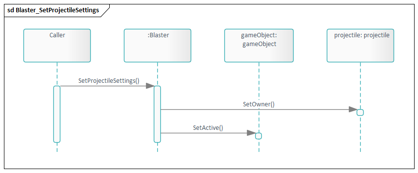
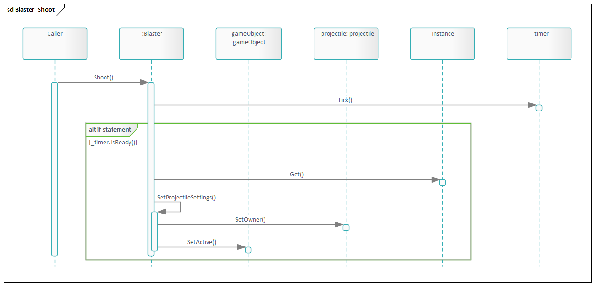
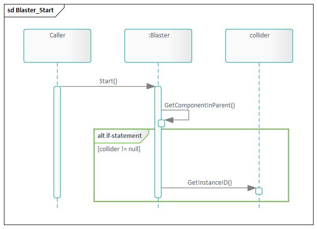
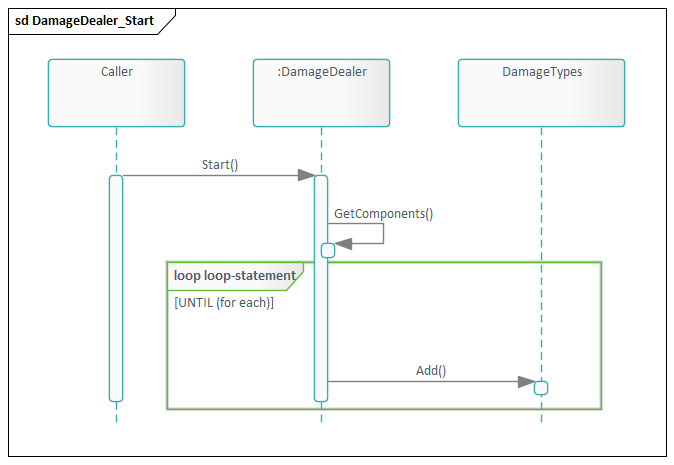
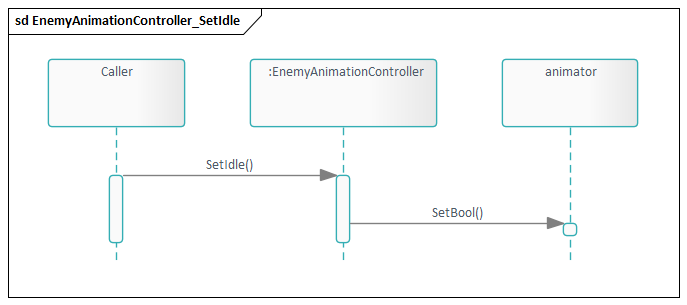
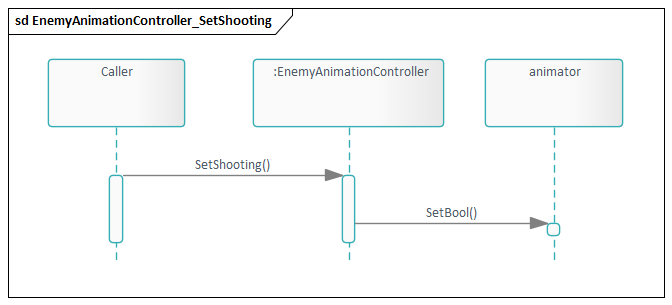

 

  
  <h3 align="center">Uncertainty:</h3>

  <h1 align="center"> Sequence Diagram </h1>
    

 
    

  
Table of Contents

  <ol>
    <li><a href="#blaster">Blaster</a></li>
    <li><a href="#damagedealer">DamageDealer</a></li>
    <li><a href="#enemyanimationcontroller">EnemyAnimationController</a></li>
  </ol>

## Blaster:  
* SetProjectileSettings function
  

* Shoot function

* Start function

## DamageDealer:  
* Start function

## EnemyAnimationController:  
* SetIdle

* SetShooting

