 

  
  <h3 align="center">Uncertainty:</h3>

  <h1 align="center"> Sequence Diagram </h1>
    

 
    

  
Table of Contents

  <ol>
    <li><a href="#blaster">Blaster</a></li>
    <li><a href="#damagedealer">DamageDealer</a></li>
    <li><a href="#enemyanimationcontroller">EnemyAnimationController</a></li>
    <li><a href="#enemychase">EnemyChase</a></li>
    <li><a href="#enemyidle">EnemyIdle</a></li>
    <li><a href="#enemypatrol">EnemyPatrol</a></li>
    <li><a href="#enemyweaponcontroller">EnemyWeaponController</a></li>
    <li><a href="#gamemanager">GameManager</a></li>
    <li><a href="#health">Health</a></li>
    <li><a href="#lookat">LookAt</a></li>
    <li><a href="#nonrepeatabletimer">NonRepeatableTimer</a></li>
    <li><a href="#poolbase">PoolBase</a></li>
    <li><a href="#shipcontroler">ShipControler</a></li>
    <li><a href="#takenormaldamage">TakeNormalDamage</a></li>
  </ol>

## Blaster:  
* SetProjectileSettings function
  

* Shoot function

* Start function

## DamageDealer:  
* Start function

## EnemyAnimationController:  
* SetIdle function

* SetShooting function

## EnemyChase:  
* Start function

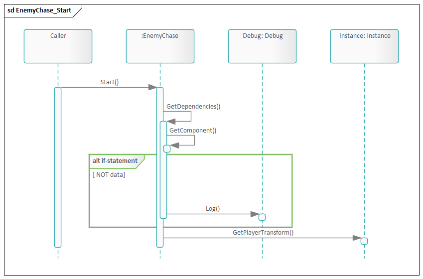

* GetDependencies function

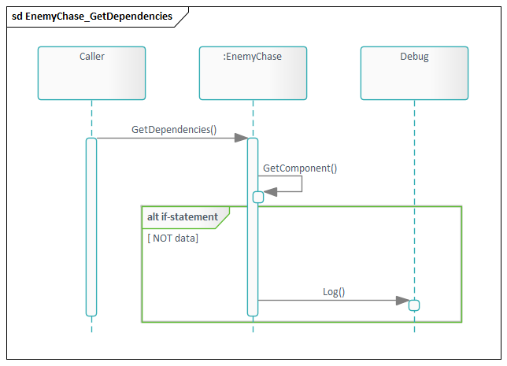

* ChasePlayer function

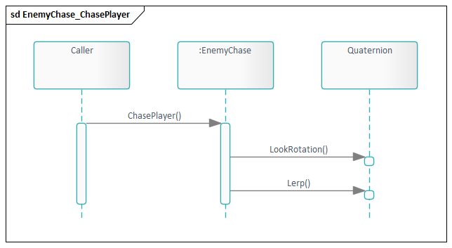

* Update function

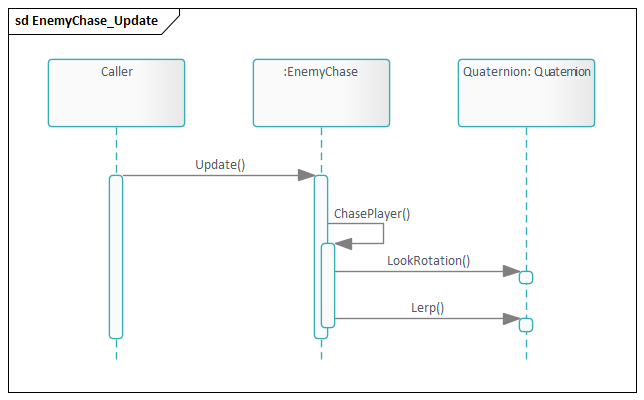

## EnemyIdle:  
* Start function

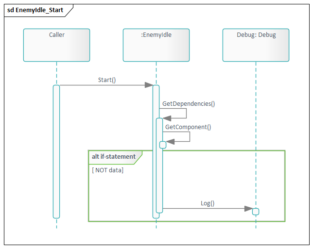

* Update function

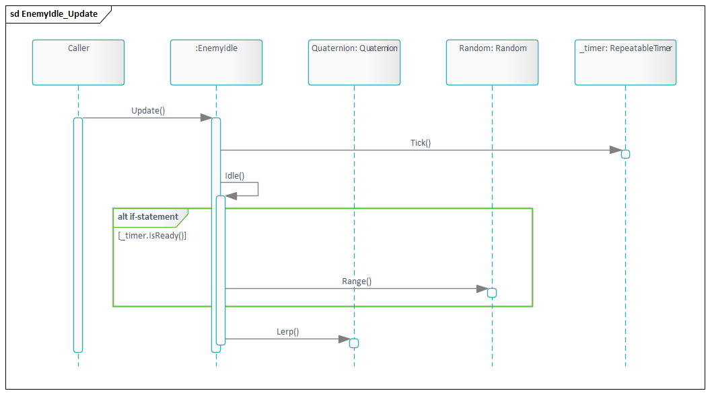

## EnemyPatrol:  
* Start function

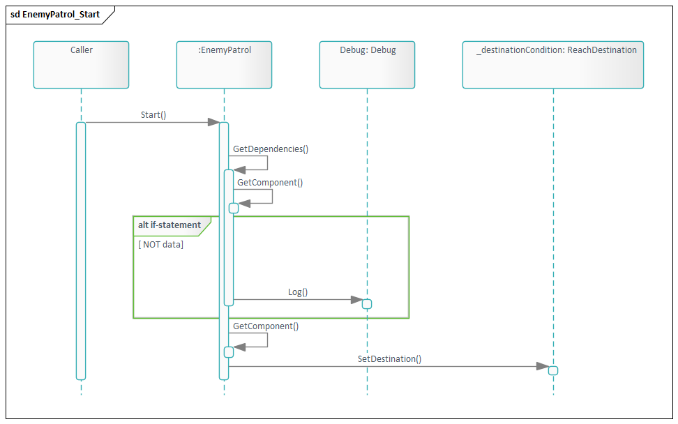

* Update function

* OnEnable function

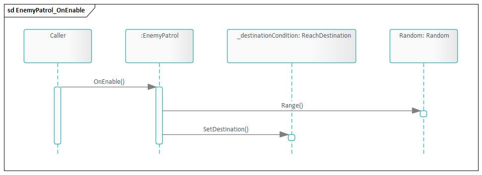

## EnemyWeaponController:  
* Update function

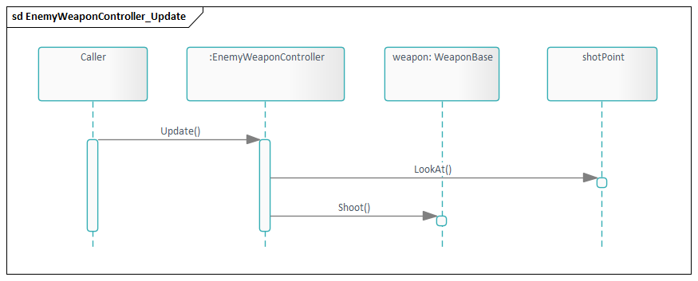

## GameManager:  
* Awake function

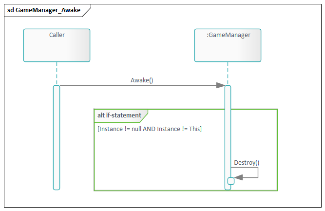

## Health:  
* ReduceHealth function

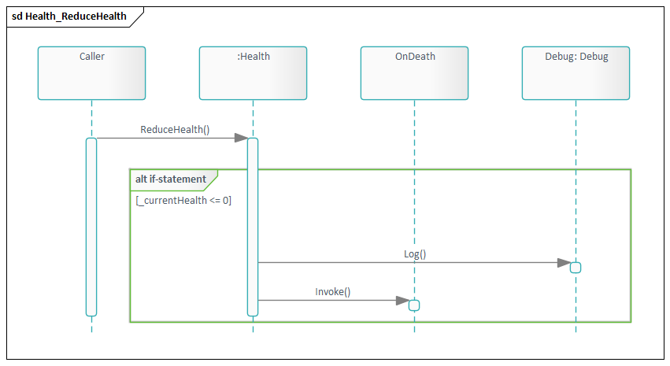

## LookAt:  
* Update function

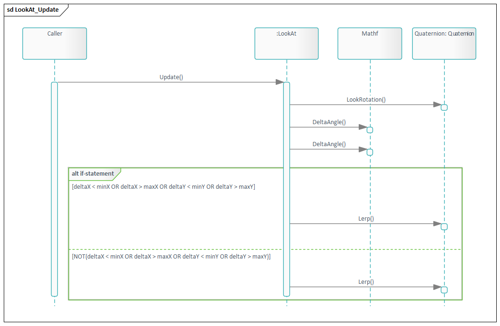

## NonRepeatableTimer:  
* Tick function

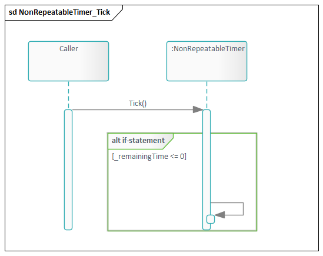

## PoolBase:  
* Awake function

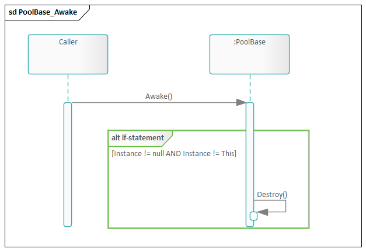

* Get function

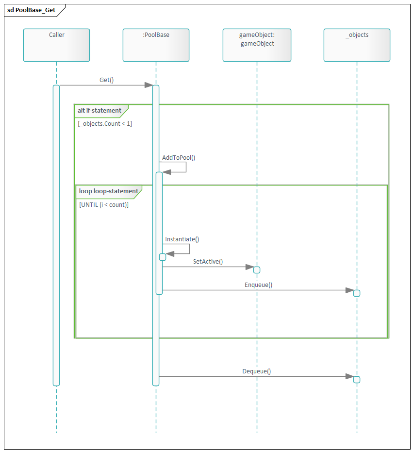

* ReturnToPool function

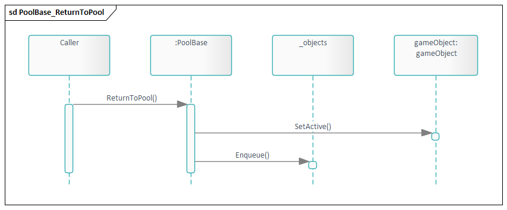

## ShipControler:  
* FixedUpdate function

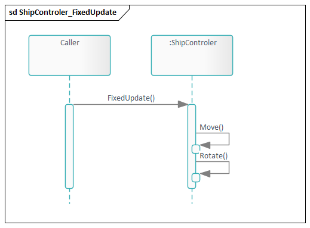

* Update function

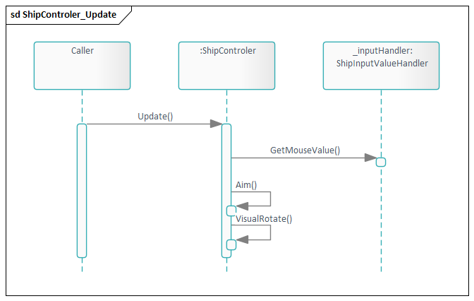

## TakeNormalDamage:  
* TakeDamage function

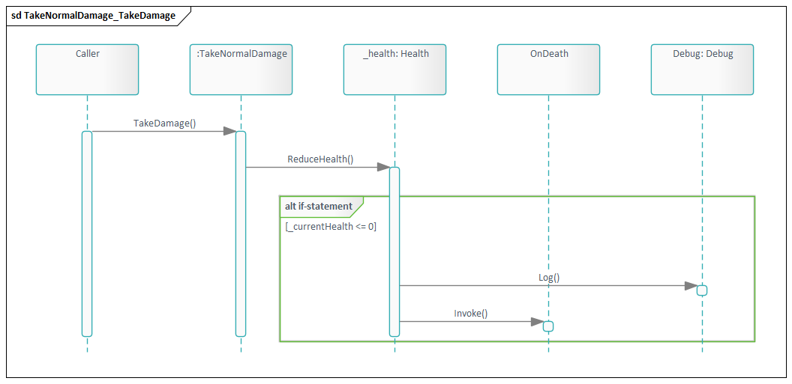

